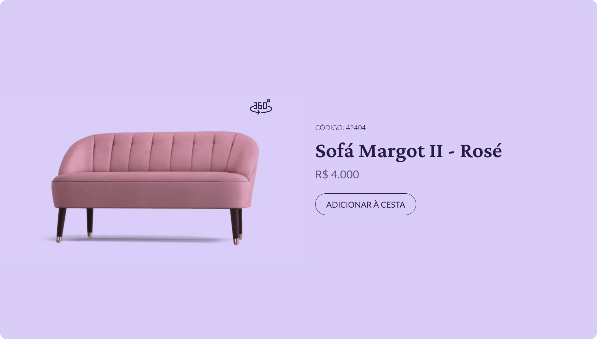

# Bora Codar

Um projeto por semana para você se desenvolver e aprimorar suas habilidades técnicas!

Proposto por: [RocketSeat](https://www.rocketseat.com.br/boracodar)

## Semana 2 - Card de Produto



## Design

### Cores

- **Cor primária:** #271A45
- **Cor secundária:** #D9CDF7

### Tipografia:

- **Fontes:** 
  - Crimson Pro
  - Lato
- **Tamanho de fonte e peso**
  - 32 / Semibold
  - 16 / Regular
  - 12 / Regular
  - 10 / Regular


## Técnologias utilizadas:

<div>
    
    
</div>

## Como utilizar SASS

1. Instale a versão mais recente do *dart sass* ***obs: o ruby sass foi descontinuado e não possui algumas features, como @use***
   
```bash
  $ npm -g install sass
```

2. Os arquivos sass/scss devem ficar na pasta *sass*, para compilar o código sass em css use:
   
```bash
 $ sass --watch scss:css
```
